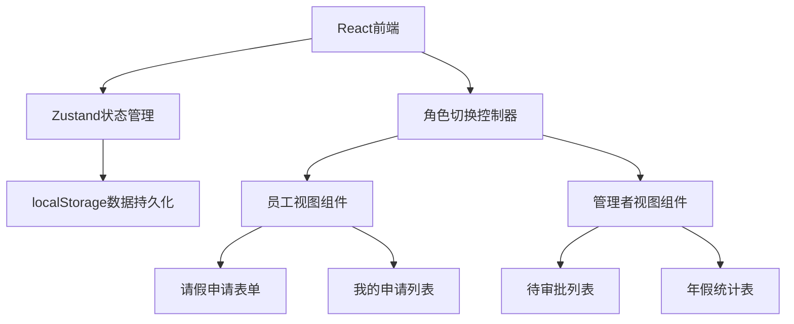
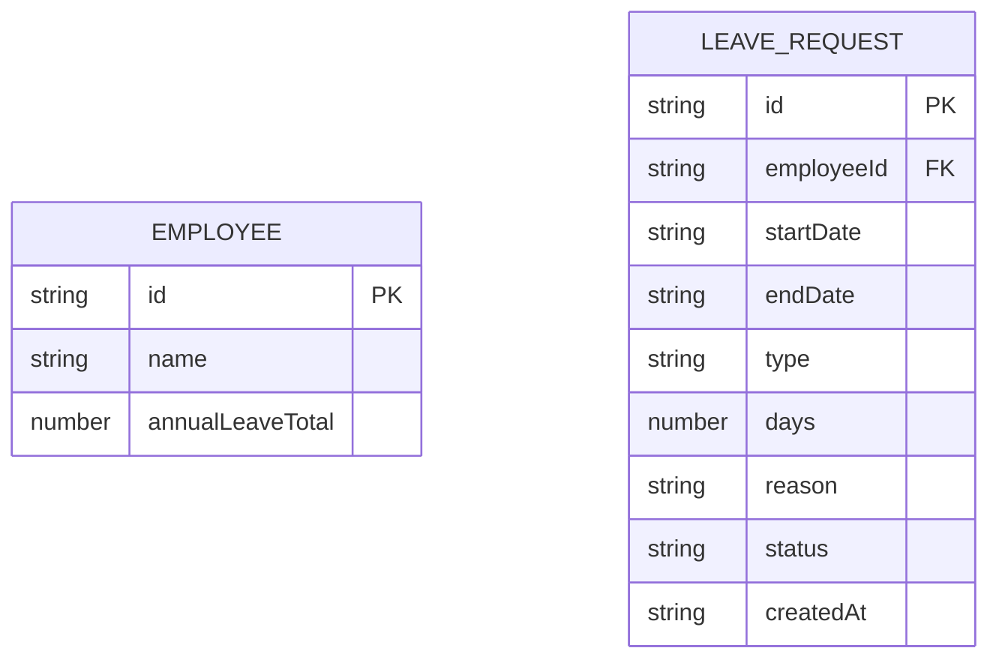

## 1. 架构设计



## 2. 技术描述
- 前端：React@18 + TypeScript + tailwindcss@3 + vite
- 初始化工具：vite-init
- 后端：无（纯前端应用）
- 数据存储：localStorage
- 状态管理：zustand
- 图标：lucide-react

## 3. 路由定义
本项目为单页面应用，不使用路由，通过状态切换视图
| 视图 | 目的 |
|------|------|
| EmployeeView | 员工操作视图 |
| ManagerView | 管理者操作视图 |

## 4. 数据模型

### 4.1 数据模型定义



### 4.2 数据结构定义

```typescript
// 员工类型
interface Employee {
  id: string;
  name: string;
  annualLeaveTotal: number; // 年假总天数
}

// 请假申请类型
type LeaveType = 'annual' | 'personal' | 'sick';
type LeaveStatus = 'pending' | 'approved' | 'rejected';

interface LeaveRequest {
  id: string;
  employeeId: string;
  employeeName: string;
  startDate: string;
  endDate: string;
  type: LeaveType;
  days: number;
  reason: string;
  status: LeaveStatus;
  createdAt: string;
}

// 角色类型
type Role = 'employee' | 'manager';
```

### 4.3 localStorage 存储键
- `leave_employees`: 员工列表
- `leave_requests`: 请假申请列表
- `leave_current_employee_id`: 当前选中的员工ID
- `leave_current_role`: 当前角色
